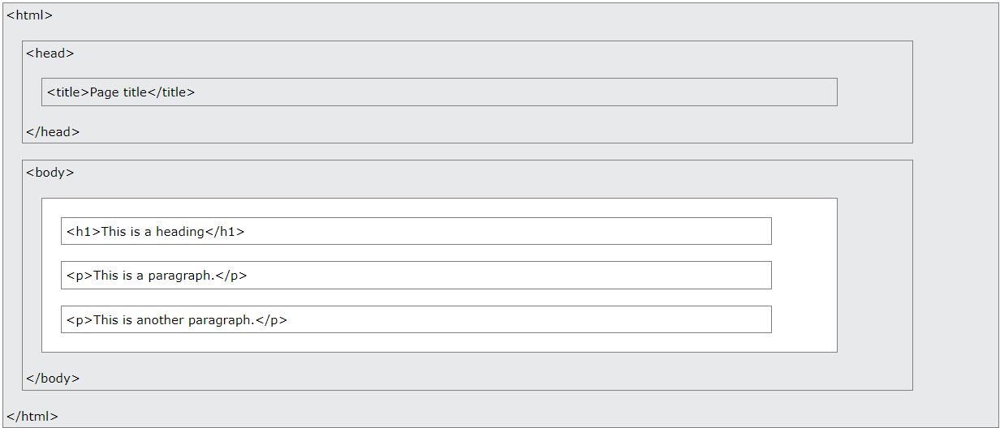

# HyperText Markup Language (HTML)

HTML is the standard markup language for creating Web pages.

## What is HTML?

- HTML stands for Hyper Text Markup Language
- HTML is the standard markup language for creating Web pages
- HTML describes the structure of a Web page
- HTML consists of a series of elements
- HTML elements tell the browser how to display the content
- HTML elements label pieces of content such as "this is a heading", "this is a paragraph", "this is a link", etc.

## What is an HTML Element?

An HTML element is defined by a start tag, some content, and an end tag:

`<tagname> Content goes here... </tagname>`

The HTML element is everything from the start tag to the end tag:

```html
<h1>My First Heading</h1>
<p>My first paragraph.</p>
```

**Note**: Some HTML elements have no content (like the `<br>` element). These elements are called empty elements. Empty elements do not have an end tag!

## HTML Page Structure

Below is a visualization of an HTML page structure:



**Note**: The content inside the `<body>` section will be displayed in a browser. The content inside the `<title>` element will be shown in the browser's title bar or in the page's tab.

## Web Browsers

The purpose of a web browser (Chrome, Edge, Firefox, Safari) is to read HTML documents and display them correctly.

A browser does not display the HTML tags, but uses them to determine how to display the document.

## HTML is Not Case Sensitive

HTML tags are not case sensitive: `<P>` means the same as `<p>`.

The HTML standard does not require lowercase tags, but W3C recommends lowercase in HTML, and demands lowercase for stricter document types like XHTML.

## Basic Website Layout


## HTML Block and Inline Elements

Every HTML element has a default display value, depending on what type of element it is.

The two most common display values are block and inline.

## Block-level Elements

A block-level element always starts on a new line, and the browsers automatically add some space (a margin) before and after the element.

A block-level element always takes up the full width available (stretches out to the left and right as far as it can).

## Inline Elements

An inline element does not start on a new line. An inline element only takes up as much width as necessary.

**Note**: An inline element cannot contain a block-level element!

## HTML Attributes

HTML attributes provide additional information about HTML elements.

- All HTML elements can have attributes
- Attributes provide additional information about elements
- Attributes are always specified in the start tag
- Attributes usually come in name/value pairs like: name="value"

## The W3C Markup Validation Service

URL: [https://validator.w3.org/](https://validator.w3.org/)

## ToDo

- [ ] svg tag
- [ ] canvas tag
- [ ] audio tag
- [ ] video tag
- [ ] iframe tag
- [ ] target attribute (parent, top)
- [ ] ...
