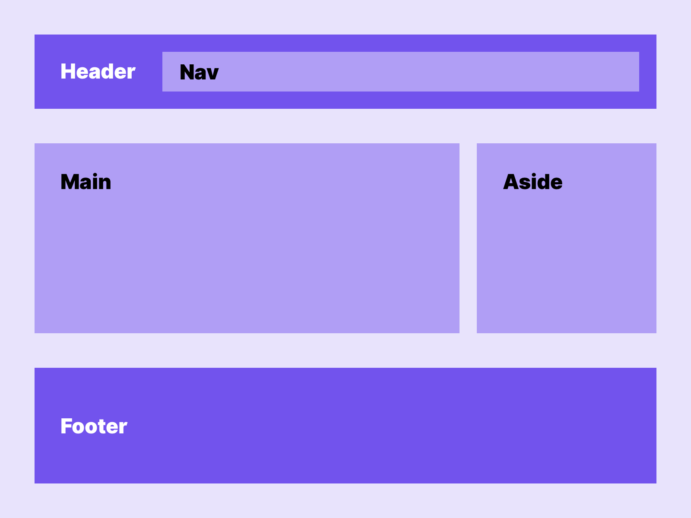

# The most important HTML tags in an overview

HTML tags or commands are used when building a website and they store the most important information for all browsers. In addition to HTML tags for the basic structure, there are also some that you can use to include media, create forms, or set the typeface.

## What are HTML tags?

If you want to learn HTML or write your own HTML code, HTML tags are probably your most important and effective tool. The HTML commands are used to pass information to the different browsers. This way the website is structured in the best possible way and can be displayed by every browser due to the information stored.

HTML tags are represented by a start and an end tag. The HTML commands are placed in angle brackets and contain the desired information, with the end tag being marked by a slash. The combination of start tag, information and end tag is called an element. It is possible to assign an HTML attribute to the element, which contributes further information.

## HTML Tags

|Tag|Description|Type|Example|Doc|
|:-:|:-|:-:|:-:|:-:|
|`<!--...-->`|Defines a comment| |[here](examples/comment.html)||
|`<!DOCTYPE>`|Defines the document type| |[here](examples/basic.html)||
|`<html>`|Defines the root of an HTML document| |[here](examples/basic.html)||
|`<head>`|Contains metadata/information for the document| |[here](examples/basic.html)||
|`<body>`|Defines the document's body| |[here](examples/basic.html)||
|`<title>`|Defines a title for the document| |[here](examples/title.html)||
|`
`|Defines a paragraph|block|[here](examples/paragraph.html)|[x](tags/p.md)|
|`<h1> to <h6>`|Defines HTML headings|block|[here](examples/headings.html)|[x](tags/headings.md)|
|`<meta>`|Defines metadata about an HTML document| |[here](examples/metadata.html)||
|`<strong>`|Defines important text|inline|[here](examples/strong.html)||
|`<small>`|Defines smaller text|inline|[here](examples/small.html)||
|`
`|Defines additional details that the user can view or hide| |[here](examples/details.html)||
|`<li>`|Defines a list item|block|[here](examples/unordered_list.html)||
|`<ol>`|Defines an ordered list|block|[here](examples/ordered_list.html)||
|`<ul>`|Defines an unordered list|block|[here](examples/unordered_list.html)||
|`<dl>`|Defines a description list|block|[here](examples/description_list.html)||
|`<dt>`|Defines a term/name in a description list|block|[here](examples/description_list.html)||
|`<dd>`|Defines a description/value of a term in a description list|block|[here](examples/description_list.html)||
|` `|Defines a single line break|inline|[here](examples/break.html)||
|`
`|Defines a thematic change in the content|block|[here](examples/horizontal_rule.html)||
|`
`|Defines a visible heading for a `
` element| |[here](examples/details.html)||
|`<b>`|Defines bold text|inline|[here](examples/bold.html)||
|`<cite>`|Defines the title of a work|inline|[here](examples/cite.html)|[x](tags/cite.md)|
|`<blockquote>`|Defines a section that is quoted from another source|block|[here](examples/blockquote.html)|[x](tags/blockquote.md)|
|`<em>`|Defines emphasized text|inline|[here](examples/emphasized.html)|[x](tags/em.md)|
|`<i>`|Defines a part of text in an alternate voice or mood|inline|[here](examples/italic.html)|[x](tags/i.md)|
|``|Defines subscripted text|inline|[here](examples/subscript.html)|[x](tags/sub.md)|
|``|Defines superscripted text|inline|[here](examples/superscript.html)|[x](tags/sup.md)|
|`<time>`|Defines a specific time (or datetime)|inline|[here](examples/time.html)||
|`<header>`|Defines a header for a document or section|block|[here](examples/semantic_structure.html)||
|`<nav>`|Defines navigation links|block|[here](examples/nav.html)||
|`<aside>`|Defines content aside from the page content|block|[here](examples/semantic_structure.html)||
|`<main>`|Specifies the main content of a document|block|[here](examples/semantic_structure.html)||
|`<section>`|Defines a section in a document|block|[here](examples/section.html)||
|`<article>`|Defines an article|block|[here](examples/semantic_structure.html)||
|`<footer>`|Defines a footer for a document or section|block|[here](examples/semantic_structure.html)||
|`
`|Defines a section in a document|block|[here](examples/div.html)|[x](tags/div.md)|
|``|Defines a section in a document|inline|[here](examples/span.html)|[x](tags/span.md)|
|`<a>`|Defines a hyperlink|inline|[here](examples/anchor.html)|[x](tags/a.md)|
|`<abbr>`|Defines an abbreviation or an acronym|inline|[here](examples/abbreviation.html)|[x](tags/abbr.md)|

## Basic Website Layout

## HTML Block and Inline Elements

Every HTML element has a default display value, depending on what type of element it is.

The two most common display values are block and inline.

## Block-level Elements

A block-level element always starts on a new line, and the browsers automatically add some space (a margin) before and after the element.

A block-level element always takes up the full width available (stretches out to the left and right as far as it can).

## Inline Elements

An inline element does not start on a new line. An inline element only takes up as much width as necessary.

**Note**: An inline element cannot contain a block-level element!
