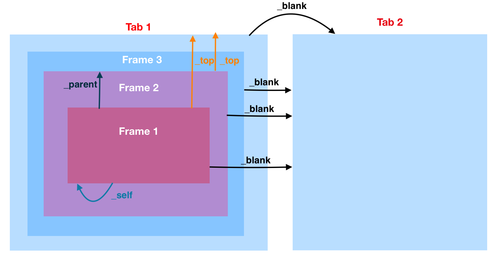

# The `<a>` Element

HTML links are hyperlinks.

You can click on a link and jump to another document.

When you move the mouse over a link, the mouse arrow will turn into a little hand.

**Note**: A link does not have to be text. A link can be an image or any other HTML element!

The HTML `<a>` tag defines a hyperlink. It has the following syntax:

```html
<a href="url">link text</a>
```

The most important attribute of the `<a>` element is the href attribute, which indicates the link's destination.

The link text is the part that will be visible to the reader.

Clicking on the link text, will send the reader to the specified URL address.

```html
<a href="https://www.w3schools.com/">Visit W3Schools.com!</a>
```

By default, links will appear as follows in all browsers:

- An unvisited link is underlined and blue
- A visited link is underlined and purple
- An active link is underlined and red

**Tip**: Links can of course be styled with CSS, to get another look!

## The target Attribute

By default, the linked page will be displayed in the current browser window. To change this, you must specify another target for the link.

The `target` attribute specifies where to open the linked document.

The `target` attribute can have one of the following values:

- `_self` - Default. Opens the document in the same window/tab as it was clicked
- `_blank` - Opens the document in a new window or tab
- `_parent` - Opens the document in the parent frame
- `_top` - Opens the document in the full body of the window
- frame name - the linked page opens in the named frame

```html
<a href="https://www.w3schools.com/" target="_blank">Visit W3Schools!</a>
```



Examples: [click here](https://www.tagindex.net/html/frame/a_target.html)

## HTML Links - Use an Image as a Link**

To use an image as a link, just put the `` tag inside the `<a>` tag:

```html
<a href="default.asp">
  
</a>
```

## Link to an Email Address

Use `mailto`: inside the `href` attribute to create a link that opens the user's email program (to let them send a new email):

```html
<a href="mailto:someone@example.com">Send email</a>
```

Button as a Link

To use an HTML button as a link, you have to add some JavaScript code.

JavaScript allows you to specify what happens at certain events, such as a click of a button:

```html
<button onclick="document.location='default.asp'">HTML Tutorial</button>
```

## Link Titles

The title attribute specifies extra information about an element. The information is most often shown as a tooltip text when the mouse moves over the element.

```html
<a href="https://www.w3schools.com/html/" title="Go to W3Schools HTML section">Visit our HTML Tutorial</a>
```

## Absolute URLs vs. Relative URLs

Both examples above are using an **absolute URL** (a full web address) in the `href` attribute.

A local link (a link to a page within the same website) is specified with a **relative URL** (without the "<https://www>" part):

```html
<h2>Absolute URLs</h2>
<p><a href="https://www.w3.org/">W3C</a></p>
<p><a href="https://www.google.com/">Google</a></p>

<h2>Relative URLs</h2>
<p><a href="html_images.asp">HTML Images</a></p>
<p><a href="/css/default.asp">CSS Tutorial</a></p>
```

## More on Absolute URLs and Relative URLs

Use a full URL to link to a web page:

```html
<a href="https://www.w3schools.com/html/default.asp">HTML tutorial</a>
```

Link to a page located in the html folder on the current web site:

```html
<a href="/html/default.asp">HTML tutorial</a>
```

Link to a page located in the same folder as the current page:

```html
<a href="default.asp">HTML tutorial</a>
```

## Download attribute

The `download` attribute specifies that the target will be downloaded when a user clicks on the hyperlink.

```html
<!DOCTYPE html>
<html>
  <body>
    <h1>The a download attribute</h1>
    <a href="/images/myw3schoolsimage.jpg" download>Click here</a>
  </body>
</html>
```

## Create a Bookmark in HTML

Bookmarks can be useful if a web page is very long.

To create a bookmark - first create the bookmark, then add a link to it.

When the link is clicked, the page will scroll down or up to the location with the bookmark.

First, use the `id` attribute to create a bookmark:

```html
<h2 id="C4">Chapter 4</h2>
```

Then, add a link to the bookmark ("Jump to Chapter 4"), from within the same page:

```html
<a href="#C4">Jump to Chapter 4</a>
```

You can also add a link to a bookmark on another page:

```html
<a href="html_demo.html#C4">Jump to Chapter 4</a>
```
