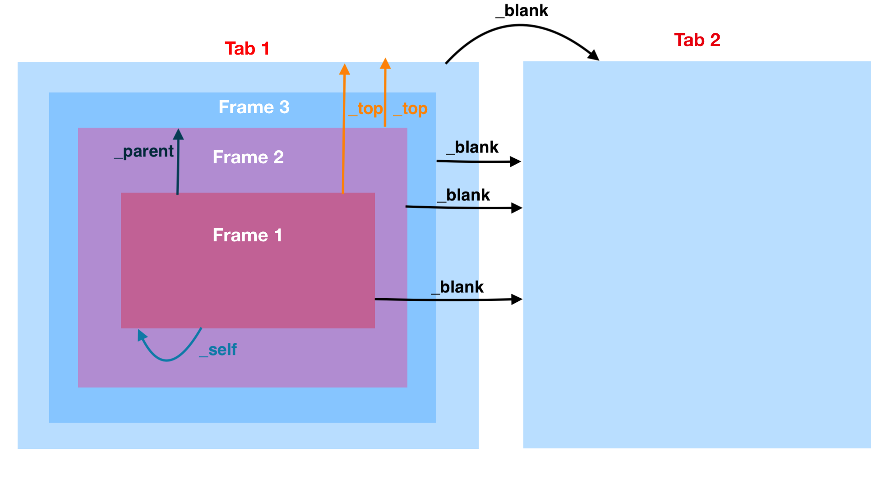

# HTML `<figure>` Tag

The `<figure>` tag specifies self-contained content, like illustrations, diagrams, photos, code listings, etc.

**Tip**: The `<figcaption>` element is used to add a caption for the `<figure>` element.

```html
<figure>
  
</figure>
```
